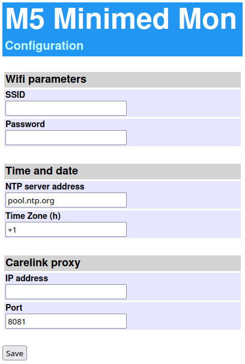
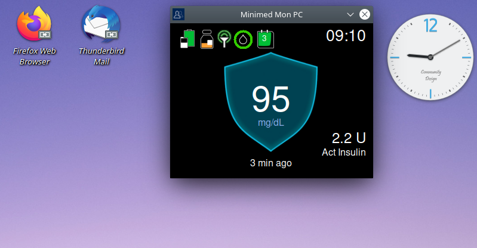

# M5Stack Minimed Monitor
This is an application for the [M5Stack Core2](https://shop.m5stack.com/collections/m5-core/products/m5stack-core2-esp32-iot-development-kit?variant=35960244109476) device. It implements a remote monitor for the Medtronic [Minimed 770G/780G](https://www.medtronicdiabetes.com/products/minimed-770g-insulin-pump-system)  insulin pump system to be used by caregivers of a Type-1 Diabetes patient wearing the pump.

Fits in nicely on your bedside table or on a shelf in the living room and lets you see all important pump and sensor data at a glance whenever you need it.


## System architecture

This project leverages the Cloud infrastructure provided by Medtronic. The picture below summarizes the architecture of the data communication path.

The data acquired by the insulin pump is transmitted periodically to the patients phone running the *Minimed Mobile* app which works as a Cloud gateway. It forwards the data to the Carelink Cloud. A phone with the *Carelink Connect* app can then pull the data from the Cloud and display it.

The *M5Stack Minimed Monitor* replaces the last piece in this communication chain. So it interfaces with the Carelink Cloud REST API (2) to receive the patients data and displays it on the M5Stack Core2s screen. It can be used in addition to the phone with *Carelink Connect* app.

Since the M5Stack Core2 device has built-in Bluetooth capability, it is theoretically possible to pull the data directly from the pump via the BLE link (1). But the communication protocol for this is yet unknown and there is no open implementation for it.


## Features

The *M5Stack Minimed Monitor* basically implements a clone of the Minimed 770G/780G insulin pump monitor screen (plus some additional info). It reports the following status information in real time:

* Latest glucose level and trend

* Pump battery charge

* Insulin reservoir level

* Sensor connection state

* Time to next calibration

* Sensor age

* Active insulin

* Pump banner state

  

A second screen displays the "Time in range" statistics. 

A third screen will display the glucose data history graph (to do).


Other features:

* Pump alarm handling (with sound and text notification)
* Device configuration via Wifi AP


## Project Status

This is a developer version, with some pieces still under construction. However I am using it on a daily basis and the functionality already implemented works reliably for me. The device runs for days and weeks without issues, reporting continuously all available data from the pump.

The main drawback, at the moment, is that the [Carelink Python Client](https://github.com/ondrej1024/carelink-python-client), which is responsible for downloading the Minimed pump and sensor data from the Carelink Cloud server, is not yet integrated into the Core2 device as this requires a porting of the client code to Micro Python. Therefore I have an external [carelink_client_proxy](https://github.com/ondrej1024/carelink-python-client/blob/main/carelink_client_proxy.py) running on a separate device which is on 24h a day and provides the data to the Core2 in the LAN via a very simple REST API. While setting this up should not be a big deal for experienced developers, I understand that it is not really "user friendly". And it prevents you from taking the monitoring device with you when travelling (well, you can do it but it will obviously not work). 

Any contributions are welcome to overcome these shortcomings.


## Todo list

* History graph for recent glucose data
* Integration of Carelink client (maybe)


## Installation

The *M5Stack Minimed Monitor* is a Micro Python application. Therefore you need to install Micro Python support on the Core2. This is done by flashing the UIFLOW (Core2) firmware using the M5Burner application. For details see the [M5Stack documentation](https://docs.m5stack.com/en/quick_start/m5core/uiflow) (chapter "Firmware burning").

**Note**: don't use any UIFLOW firmware version newer than 1.9.7 as some fonts which *M5Stack Minimed Monitor* needs have been removed in the later versions.

After booting the device with the UIFLOW firmware you have to select "USB mode" from the "Flow" menu.

Then you can load and run the application  `minimed-mon.py`  on the Core2 using your favorite Python editor with Micro Python support. I have made good experience with the [Thonny editor](https://thonny.org). But [VS Code](https://code.visualstudio.com) with the M5Stack plugin should also work. 

Note that you also have to transfer the `res/` folder containing all the needed image files to the Core2 flash memory.

To run the application automatically at startup, place the Python file `minimed-mon.py` in the `apps/` folder of the Core2 flash memory. On the next restart of the Core2 choose this file from the "App" menu and choose "Run". You might have to reset the Core2 after that.


## Configuration

Before using the *M5 Minimed Monitor*, there are basically 3 items which need to be configured:

* Credentials of your Wifi network
* An NTP server address and your time zone
* The network address of the Carelink proxy

When starting the *M5 Minimed Monitor* for the first time (or if Wifi connection cannot be established with the current configuration), it will automatically switch into Access Point (configuration) mode and prompt you to connect to the Wifi network "M5_MINIMED_MON" (password is `123456789`) with your mobile phone or a PC. Then you can connect to the configuration Web UI at `http://192.168.4.1`




Once you have finished the configuration, it will be saved on the Core2s flash memory and the *M5 Minimed Monitor* will reboot. If everything went well, it starts displaying the pump data after reboot.

The active configuration data can be displayed on screen #3 of the Core2, accessible via its bottom right button. On the same screen the configuration can be reset via the "Reset config" button. This will clear the configuration parameters on the flash memory and restart the Core2 in configuration mode.


## Minimed Monitor for PC

There is also an experimental version of the Minimed Monitor which runs on a PC. It has the same code base as the M5 Stack version plus some wrapper functions for the M5 Stack specific graphics API. This is very handy for testing new features and running the program directly on your desktop.




To run this program you need Python 3 installed on your PC. You can start the program from the console typing the following command: 

```
$ python3 minimed-mon-pc.py
```

Be sure to modify the following lines in `minimed-mon-pc.py` with the IP address where your Carelink Python Client is running:

```
proxyaddr = "0.0.0.0" # Replace with your Carelink Python Client IP address
proxyport = 8081 
```


## Disclaimer

This project is not associated to or endorsed by [Medtronic](https://www.medtronicdiabetes.com). If you decide to use the *M5Stack Minimed Monitor* then you do this entirely at your own risk. I am not reliable for any damage it might cause. 

