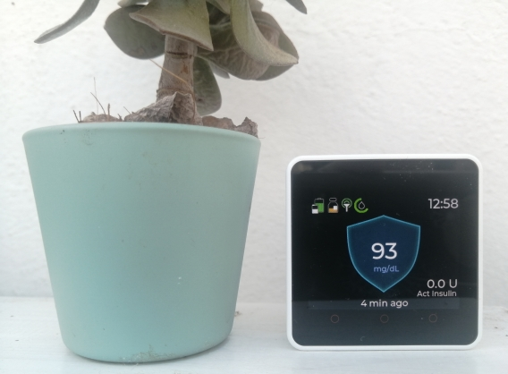
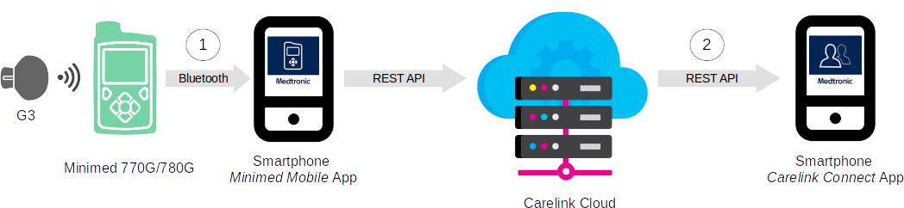

# M5Stack Minimed Monitor
This is an application for the [M5Stack Core2](https://shop.m5stack.com/collections/m5-core/products/m5stack-core2-esp32-iot-development-kit?variant=35960244109476) device. It implements a remote monitor for the Medtronic [Minimed 770G/780G](https://www.medtronicdiabetes.com/products/minimed-770g-insulin-pump-system)  insulin pump system to be used by caregivers of  Type-1 Diabetes patients wearing the pump.

## System architecture

This project leverages the Cloud infrastructure provided by Medtronic. The picture below summarizes the architecture of the data communication path.

The data acquired by the insulin pump is transmitted periodically to the patients phone running the *Minimed Mobile* app which works as a Cloud gateway. It forwards the data to the Carelink Cloud. A phone with the *Carelink Connect* app can then pull the data from the Cloud and display it.

The *M5Stack Minimed Monitor* replaces the last piece in this communication chain. So it interfaces with the Carelink Cloud REST API (2) to receive the patients data and displays it on the M5Stack Core2s screen. It can be used in addition to the phone with *Carelink Connect* app.

Since the M5Stack Core2 device has built-in Bluetooth capability, it is theoretically possible to pull the data directly from the pump via the BLE link (1). But the communication protocol for this is yet unknown and there is no open implementation for it.

## Features

The *M5Stack Minimed Monitor* basically implements a clone of the Minimed 770G/780G insulin pump monitor screen. It reports the following status information in real time:

* Latest glucose level and trend
* Pump battery charge
* Insulin reservoir level
* Sensor connection state
* Time to next calibration
* Active insulin

A second screen displays the "Time in range" statistics. 

A third screen will display the glucose data history graph (to do).

## Project Status

This is a developer version, with a lot of pieces still under construction. However I am using it on a daily basis and the functionality already implemented works reliably for me.

The main drawback, at the moment, is that the [Carelink Python Client](https://github.com/ondrej1024/carelink-python-client), which is responsible for downloading the Minimed pump and sensor data from the Carelink Cloud server, is not yet integrated into the Core2 device as this requires a porting of the client code to Micro Python. Therefore I have an external [carelink_client_proxy](https://github.com/ondrej1024/carelink-python-client/blob/main/carelink_client_proxy.py) running on a separate device which is on 24h a day and provides the data to the Core2 in the LAN via a very simple REST API.

Any contributions are welcome.

## Todo list

* History graph for recent glucose data
* Alarm handling (sound and notification)
* Configuration via config file on SD card or Wifi AP
* Integration of Carelink client
* Extensive error handling

## Installation

The *M5Stack Minimed Monitor* is a Micro Python application. Therefore you need to install Micro Python support on the Core2. This is done by flashing the UIFLOW (Core2) firmware using the M5Burner application. For details see the [M5Stack documentation](https://docs.m5stack.com/en/quick_start/m5core/m5stack_core_get_started_MicroPython) (chapter "Firmware burning").

After booting the device with the UIFLOW firmware you have to select "USB mode" from the "Flow" menu.

Then you can load and run the application  `minimed-mon.py`  on the Core2 using your favorite Python editor with Micro Python support. I have made good experience with the [Thonny editor](https://thonny.org). But [VS Code](https://code.visualstudio.com) with the M5Stack plugin should also work. 

Note that you also have to transfer `res/` folder containing all the needed image files to the Core2 flash memory.

To run the application automatically at startup, place the Python file `minimed-mon.py` in the `apps/` folder of the Core2 flash memory. On the next restart of the Core2 choose this file from the "App" menu and choose "Run".

## Disclaimer

This project is not associated to or endorsed by [Medtronic](https://www.medtronicdiabetes.com). If you decide to use the *M5Stack Minimed Monitor* then you do this entirely at your own risk. I am not reliable for any damage it might cause. 

